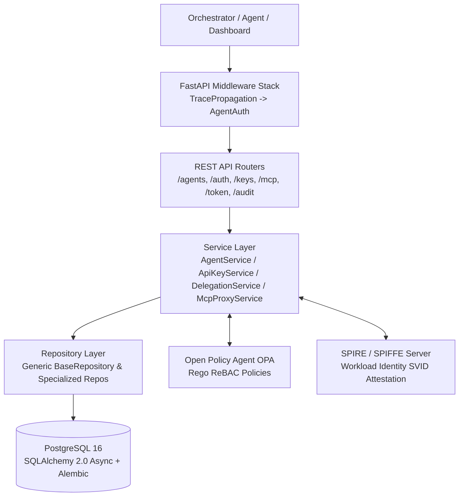

# AI-IAM Platform Architecture

The **AI-IAM Platform** ("Auth0 for AI Agents") provides enterprise-grade identity, access management, governance, and audit verification for autonomous AI agents and tool orchestrations.

---

## 1. High-Level Architecture & Component Interaction

---

## 2. Core Architectural Pillars

### A. Fail-Closed Security Boundary
Every external boundary enforces a **fail-closed** policy:
- **Pre-Execution Interception (`McpProxyService`)**: Tool execution requests (`/api/v1/mcp/tools/{tool_name}`) are intercepted *before* contacting any external MCP server. If Open Policy Agent (OPA) returns a denial, or if the policy endpoint is unreachable, the request is immediately rejected (`HTTP 403 / 502`), preventing unauthorized side effects.
- **Trace Propagation (`TracePropagationMiddleware`)**: Every request is assigned a unique `X-Trace-ID` header upon ingress, ensuring end-to-end causal tracking across all database operations and external calls.

### B. Two-Phase Agent Lifecycle
Agent identity creation is split into two phases (`PENDING` $\rightarrow$ `ACTIVE` $\rightarrow$ `SUSPENDED` $\rightarrow$ `DECOMMISSIONED`):
1. **Registration (`AgentService.register`)**: Validates parent agent lineage, scopes, and ephemeral TTLs, persisting the agent in `PENDING` state.
2. **Attestation & Activation (`AgentService.activate`)**: Interacts with SPIRE to provision a unique SPIFFE Workload Identity (`spiffe://ai-iam.internal/ns/{org_id}/sa/{agent_id}`), transitioning the agent to `ACTIVE` and issuing initial credentials.

### C. Zero-Downtime Credential Rotation
API keys undergo seamless rotation via `ApiKeyService.rotate_key`:
- When a key is rotated, a new key pair (`aiiam_...`) is issued.
- The previous secret's `bcrypt` hash is stored inside `previous_hashed_secret` with an explicit `grace_period_hours` expiration window.
- During this window, both keys are valid, enabling zero-downtime updates in distributed multi-agent clusters.

---

## 3. Technology Stack

| Layer | Technology | Purpose |
| :--- | :--- | :--- |
| **Backend API** | FastAPI + Python 3.11 | High-concurrency async HTTP REST API |
| **ORM & Database** | SQLAlchemy 2.0 (`asyncpg`) + PostgreSQL 16 | Typed async data layer and persistence |
| **Access Control** | Open Policy Agent (OPA + Rego) | Fine-grained ReBAC (Relationship-Based Access Control) |
| **Workload Identity** | SPIFFE / SPIRE | Cryptographic workload attestation (`SVIDs`) |
| **Token Exchange** | RS256 / HS256 JWTs | Short-lived agent tokens (`Bearer`) and operator tokens |
| **Audit Log Integrity** | SHA256 Causal Hash Chain | Append-only, tamper-evident sequence linking |
