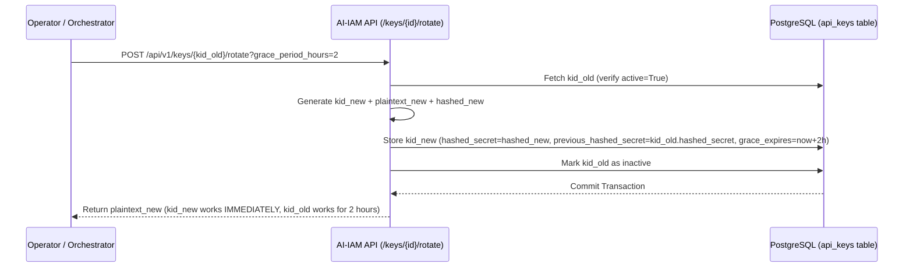

# Credential Lifecycle & Zero-Downtime Rotation

The AI-IAM Platform implements zero-plaintext storage and zero-downtime rotation windows for all agent credentials.

---

## 1. Zero-Plaintext Credential Storage

To guarantee zero exposure of sensitive secrets even in the event of a database dump breach:
1. **Key Generation**: When an API key (`aiiam_abc123...`) is generated via `generate_api_key()`, it consists of a prefix (`aiiam_`) and a secure 32-byte URL-safe random string.
2. **One-Time Transmission**: The plaintext string is returned **exactly once** in the `ApiKeyIssueResponse` DTO (`plaintext_key`).
3. **Bcrypt Hashing**: Only the `bcrypt` hash (`hashed_secret`) and a non-sensitive 4-character hint (`key_hint`) are stored in PostgreSQL.

---

## 2. Zero-Downtime Key Rotation Flow

### Grace Window Verification Flow (`ApiKeyService.verify_key`)
When an agent authenticates with an API key during the rotation grace period:
1. The service checks the active key record (`kid_new`).
2. If the plaintext key matches `hashed_secret` $\rightarrow$ standard success.
3. If the key matches `previous_hashed_secret` **and** `now < previous_key_expires_at` $\rightarrow$ authentication is accepted, but an audit warning (`client_using_rotated_key`) is logged to alert administrators that the agent configuration needs updating.
4. Once `now >= previous_key_expires_at`, authentication via the old key is rejected (`HTTP 401 Unauthorized`).
